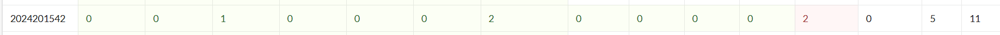

BombLab 实验报告
姓名： 2024201542
学号： 2024201542

解题报告
phase_1
答案：
text
Why'd you curse me with `you're a natural born genius`?
解题思路：
通过反汇编找到 phase_1 函数，发现其调用 strings_not_equal 函数比较输入字符串与内存中的固定字符串。使用 objdump -s -j .rodata 查看 .rodata 段，找到地址 0x3180 处的字符串即为答案。

phase_2
答案：
text
1214923 1266393 954315 1110979
解题思路：
phase_2 读取 4 个整数，然后进行矩阵乘法运算。从 .data 段提取矩阵数据：

matA (2×3): [[734, 703, 302], [551, 136, 583]]

matB (3×2): 列向量 [553, 747, 940] 和 [845, 493, 992]
计算 matA × matB 得到 2×2 结果矩阵，即为答案。

phase_3
答案：
text
4 0
（或 5 -248）
解题思路：
phase_3 实现了一个 switch 语句，读取两个整数。第一个数选择 case（必须 ≤5），第二个数必须为负数。分析跳转表（位于 0x3220）发现 case 4 和 case 5 可以避开炸弹。case 4 的计算结果为 0，case 5 的计算结果为 -248。选择较简单的 case 4。

phase_4
答案：
text
31 CB mystic
（添加 mystic 以触发 secret phase）
解题思路：
phase_4 涉及汉诺塔问题。
func4_1(n) 计算 $2^n-1$，即汉诺塔最小移动次数。调用 func4_1(5) 得 31，为第一个输入。
func4_2(5, 27, 'A', 'C', 'B') 递归模拟汉诺塔移动过程，计算第 27 步移动的源柱和目标柱，结果为 "CB"。
在输入后添加 mystic 可触发 secret phase。

phase_5
答案：
text
cfmeph
解题思路：
phase_5 是一个字符替换密码：
输入 6 个字符，每个字符按 (char + 15) & 0xF 计算索引。
从查找表 "maduiersnfotvbyl" 中取字符，结果必须等于 "devils"。
逆向计算每个位置所需索引，找到对应的输入字符。

phase_6
答案：
text
3 1 6 5 4 2
解题思路：
phase_6 涉及链表排序：
读取 6 个不同数字（1-6），根据输入重排链表节点。
节点值分别为：node1=839, node2=248, node3=983, node4=474, node5=615, node6=771。
要求最终链表按值降序排列，对应节点顺序为 3, 1, 6, 5, 4, 2。
secret_phase
触发条件： 在 phase_4 输入后添加 mystic。
答案：
text
2227143
解题思路：
fun7 实现了一个迷宫导航问题：
起点 (0,0)，终点 (4,7)，使用国际象棋骑士的移动方式。

移动表：col_move1 = [-2,-1,1,2,2,1,-1,-2], row_move1 = [1,2,2,1,-1,-2,-2,-1]。
输入字符串的每个字符的低 3 位决定移动方向。
使用 BFS 搜索有效路径，得到移动序列 "2227143"。

反馈/收获/感悟/总结
本次实验通过逆向工程分析二进制炸弹程序，深入理解了 x86-64 汇编语言、函数调用约定、栈帧结构、控制流、数据结构等底层知识。掌握了使用 objdump、gdb 等工具进行静态和动态分析的方法。实验涵盖了字符串处理、数学运算、递归算法、链表、矩阵乘法、密码学、迷宫搜索等多个知识点，是对计算机系统原理的综合实践。
实验中遇到的主要困难是 secret phase 的迷宫导航问题，通过编写 Python 脚本模拟 BFS 搜索得以解决。整个过程锻炼了逻辑思维和问题解决能力。

参考的重要资料
《深入理解计算机系统》 – 关于汇编、内存、链接的章节

x86-64 汇编语言指南 – 用于理解指令和寄存器
